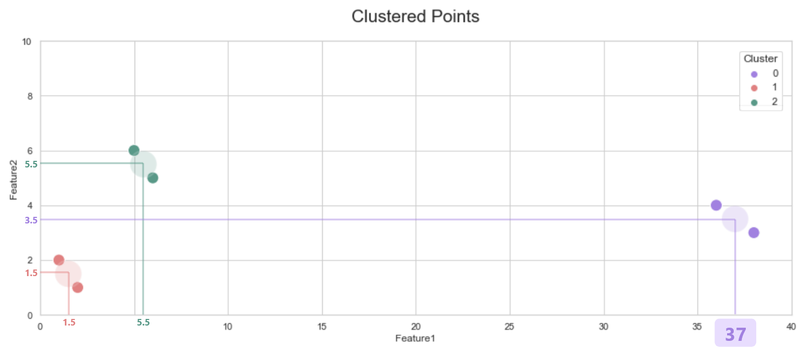
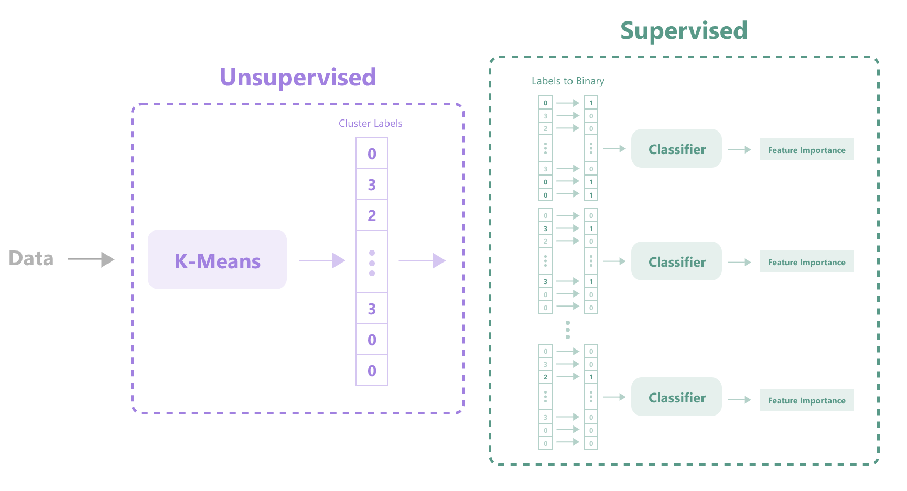
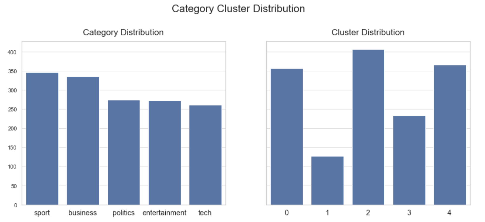
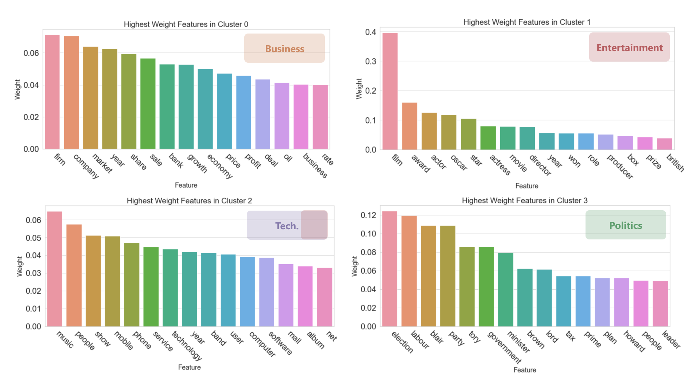
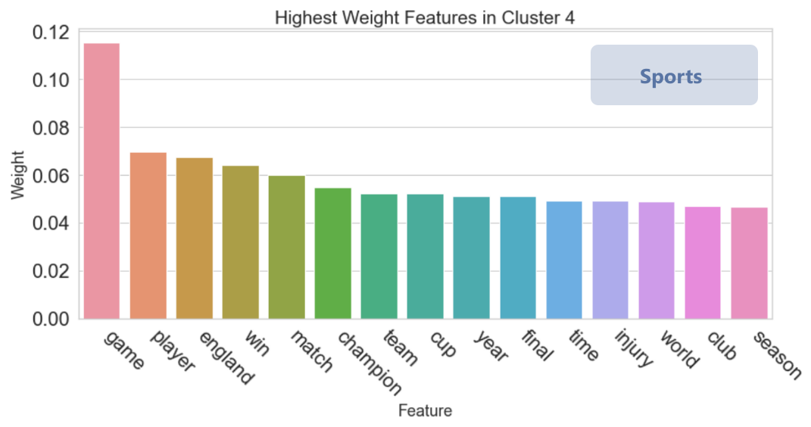
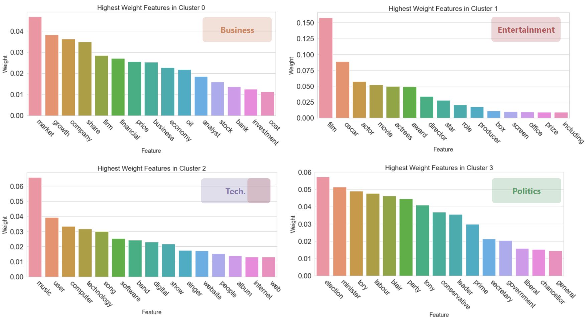
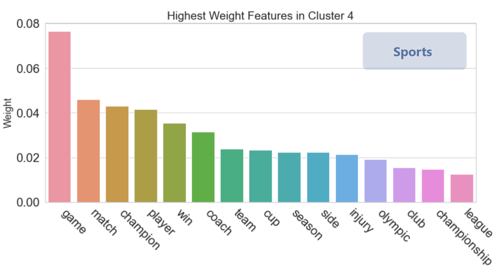

# kmeans-feature-importance
kmeans_interp is a wrapper around `sklearn.cluster.KMeans` which adds the property `feature_importances_` that will act as a cluster-based feature weighting technique. Features are weighted using either of the two methods: `wcss_min` or `unsup2sup`.

## Methodology
### WCSS Minimizer


The method is a direct analysis of each centroid's sub-optimal position. K-Means aim is to minimize the Within-Cluster Sum of Squares and consequently the Between-Cluster Sum of Squares, and assuming that the distance metric used is euclidean. The euclidean distance from a cluster centroid C_j and point p_i:


<p align="center" width="100%">
	
</p>


And the WCSS for one cluster C_j that has p_m points is (Excuse the usage of i differently):

<p align="center" width="100%">
	
</p>

Then we will try to find the feature d_i that was responsible for the highest amount of WCSS (The sum of squares of each data point distance to its cluster centroid) minimization through finding the maximum absolute centroid dimensional movement. 

### Unsupervised 2 Supervised



Another interpretation approach is to convert the unsupervised classification problem into a supervised classification settings using an easily interpretable model such as tree-based models (We will be using a Random Forest Classifier). The steps to do this is as follows:

1. Change the cluster labels into  One-vs-All for each label
2. Train a classifier to discriminate between each cluster and all other clusters
3. Extract the feature importances from the model (We will be using `sklearn.ensemble.RandomForestClassifier`)


## Usage 
You can instantiate `KMeansInterp` in the same way you `sklearn.cluster.KMeans` is instantiated, but you will need to provide the feature names to `ordered_feature_names` parameter, which should have the order of X dimensions. 

```python
from kmeans_interp.kmeans_feature_imp import KMeansInterp

X = pd.DataFrame(...) # DataFrame is an example to deliver the idea of features order

kms = KMeansInterp(n_clusters=5,
                   ordered_feature_names=X.columns.tolist(), 
                   feature_importance_method='wcss_min', # or 'unsup2sup'
                  ).fit(X.values)

# A dictionary where the key [0] is the cluster label, and [:10] will refer to the first 10 most important features
kms.feature_importances_[0][:10] # Features here are words
# [('film', 0.39589216529770005),
#  ('award', 0.1605575985825074),
#  ('actor', 0.12619074083837967),
#  ('oscar', 0.1178746877093894),
#  ('star', 0.1048044246433086),
#  ('actress', 0.0805780582173732),
#  ('movie', 0.07849181814402928),
#  ('director', 0.07750076034520005),
#  ('year', 0.05714139742209183),
#  ('won', 0.05598607819724065)]

```

The method was applied on a natural language processing (NLP) example which could be considered as an unsupervised cluster based keyword extraction technique:

## Example Output
I have chosen to apply the interpretation technique on an NLP problem since we can easily relate to the feature importances (words) which could be considered as a corpus-based keyword extraction technique where our aim is to cluster similar documents together using K-Means, and then apply the methods above. The dataset I have used can be found here [Kaggle BBC-News](https://www.kaggle.com/c/learn-ai-bbc/data?select=BBC+News+Train.csv). This dataset presents a classification problem but we will be using the categories as a final comparison



### Category Cluster Feature Comparison `min_wcss`







### Category Cluster Feature Comparison `unsup2sup`







## Requirements
```
scikit-learn~=0.24.2
numpy~=1.17.0
```


## References

1. Y. Liu, Z. Li, H. Xiong, X. Gao and J. Wu, "Understanding of Internal Clustering Validation Measures," 2010 IEEE International Conference on Data Mining, 2010, pp. 911-916, doi: 10.1109/ICDM.2010.35.

2. Kriegel, HP., Schubert, E. & Zimek, A. The (black) art of runtime evaluation: Are we comparing algorithms or implementations?. Knowl Inf Syst 52, 341–378 (2017). https://doi.org/10.1007/s10115-016-1004-2

3. Ng, A., & Piech, C. (2021). CS221. Retrieved 18 July 2021, from https://stanford.edu/~cpiech/cs221/handouts/kmeans.html

4. Ismaili, Oumaima & Lemaire, Vincent & Cornuéjols, Antoine. (2014). A Supervised Methodology to Measure the Variables Contribution to a Clustering. 159-166. 10.1007/978-3-319-12637-1_20. 